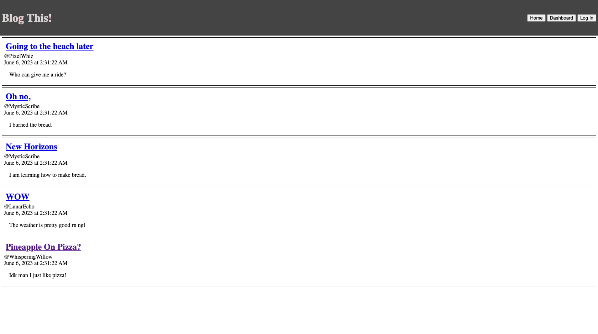

# Blog This!

## Description
Blog This! is a simple CMS blogging website where users can create and view blog posts. This project was a wonderful exercise in creating database models and writing CRUD routes which can be called by the user through interaction with the front end. While the UI is extremely rudimentary, I am proud of what I was able to accomplish on the server side of this application, which was my focus in this exercise.

## Instructions

- The Home page displays a preview of all posts by all users. The posts are sorted newest to oldest so that users can easily catch up with what has been posted since their last visit. This harkens back to a simpler internet, when social media feeds were displayed in chronological order rather than according to the hidden logic of an elusive algorithm.
- When users click the title of a post, they are routed to a new page containing the full blog post and comments left by other users, where they can add comments of their own. If the user is not logged in, a link to the Login page will display where the Add Comment option would display for a logged in user.

- The Dashboard page is where users can view, create, update and/or delete their own posts. If the user is not logged in, the Dashboard button will reroute them to the login page.

- The Login page contains an object which allows the user to create an account. If none of the fields are left blank, and the two password fields match, an account will be created and the new user will be rerouted to their new, empty dashboard. The user's session expires one hour after logging in.

# Application
[Deployed Application](https://peaceful-cove-90447.herokuapp.com/)
